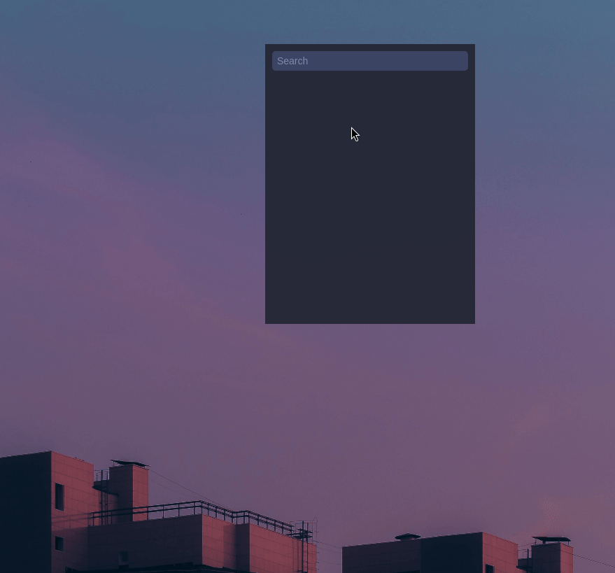
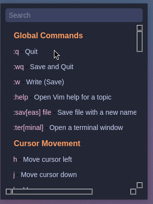
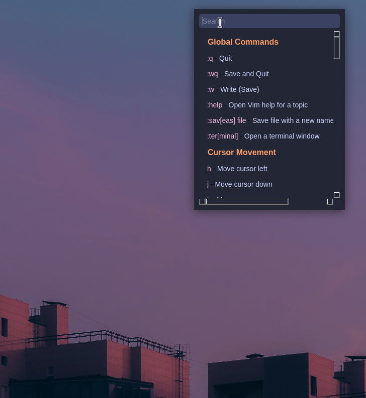

# indxware.py

I made this to quickly recall and organize **VIM commands**. However, it’s flexible enough to be used for just about anything you want to index and access quickly—whether it’s Linux commands, personal notes, or even a project checklist.

You can add new commands or things you want to remember so you can look them up without opening up a browser (plus it matches my desktop).

## Features






* **Quick Recall**: Search through indexed notes or commands instantly. Type your search, press Enter to filter, and press Enter again to toggle back to the main list.
* **Customizable Categories**: Organize your notes or commands under categories using the 'command.json' file.
* **Resizing and Frameless Mode**: Resize the window for flexibility or toggle the frameless mode with `Ctrl+G`. 
* **Hotkeys**: Use `Ctrl+S` to save, `Ctrl+L` to load, `Ctrl+G` to toggle frameless mode, and `Ctrl+Q` to exit.
* **Right-click Menu**: Save, load, exit, or toggle the frameless window with a simple right-click.

## Prerequisites

* Python 3
* PyQt5 (`pip install PyQt5`)

## Usage

1. Run the script using Python3: 
   `python3 indxware.py`
2. Type in the search bar to filter through commands or notes.
3. Press **Enter** to toggle between filtered and full list views. Press **Enter** again to return to the main screen.
4. Toggle the frameless window with **Ctrl+G**, or access the right-click menu for quick options.

### Default Categories

You can change the default categories in the main python file. Mine are set to some simple VIM commands.

'''python
        else:
            # Default command set (VIM)
            self.commands = [
                { "category": "Global Commands" },
                ":w - Save",
                ":q - Quit",
                ":wq - Save and Quit",
                { "category": "Editing" },
                "i - Insert Mode",
                "dd - Delete Line",
                "yy - Yank Line",
                "p - Paste",
                { "category": "Search and Replace" },
                "/search - Search",
                ":s - Replace",
                "u - Undo",
                "Ctrl+r - Redo"
            ]
'''
### Customizing Categories

The categories are defined in the `commands.json` file, which must be in the same directory as indxware.py. 
Each category is labeled with `"category"`, and commands or notes are just strings.

```json
[
    { "category": "Global Commands" },
    ":w - Save",
    ":q - Quit",
    ":wq - Save and Quit",
    { "category": "Editing" },
    "i - Insert Mode",
    "dd - Delete Line",
    "yy - Yank Line"
]
```

To add a new category or note:
1. Open `commands.json` in a text editor.
2. Add new categories using the `"category"` key.
3. List your commands or notes under each category.
4. Save and load.

### Customizing the Colors

Right now, **indxware.py** uses a Catppuccin-like color scheme. If you want to switch things up, you can open the Python script and find the section labeled `Colors`. 
You’ll see hex codes like this:

```python
BG = "#232634"  # Background color
TEXT = "#cad3f5"  # Default text color
ACCENT = "#b7bdf8"  # Highlighted text color
HIGHLIGHT = "#3b4261"  # Background highlight color
COMMAND_COLOR = "#f5bde6"  # Command text color (pink)
CATEGORY_COLOR = "#ff9e64"  # Category title color (orange)
```

Feel free to change the hex codes to any colors you like. Want a dark theme? Change `BG`. Want a pop of neon for commands? Change `COMMAND_COLOR`. It’s all in the Python file, right at the top.

### Other Customizations

1. **Hotkeys**: All the hotkeys are stored in the `SHORTCUTS` dictionary. Modify these to whatever works for you.
2. **Window Behavior**: Want to change the window size or positioning? You’ll find those settings under `initUI` and `toggle_frameless`. The window is fully resizable, and you can toggle frameless mode with a hotkey or via the right-click menu.

## Author

[booknite]

## License

This project is free to use, edit, or revise any way you like. 
